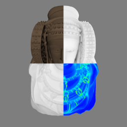

Quoniam
=======
[](https://ci.appveyor.com/project/limdor/quoniam/branch/master)



**quaniam** is a framework for viewpoint selection of 3D models.
It is the implementation of the [paper published in the Entropy journal on 2018](http://www.mdpi.com/1099-4300/20/5/370).
If you find this framework useful, please considering citing the paper:

```
@article{Bonaventura18,
    author         = {Xavier Bonaventura and Miquel Feixas and Mateu Sbert and Lewis Chuang and Christian Wallraven},
    title          = {A Survey of Viewpoint Selection Methods for Polygonal Models},
    journal        = {Entropy},
    volume         = {20},
    year           = {2018},
    number         = {5},
    article-number = {370},
    url            = {http://www.mdpi.com/1099-4300/20/5/370},
    issn           = {1099-4300},
    doi            = {10.3390/e20050370}
}
```

## Quoniam contains the following third party libraries:

* [Assimp](http://assimp.sourceforge.net/main_downloads.html)
* [glew](http://glew.sourceforge.net/)
* [glm](http://glm.g-truc.net/download.html)
* [Miniball](http://www.inf.ethz.ch/personal/gaertner/miniball.html)
* [OpenCV](http://opencv.org/)
* [Qt](http://qt.nokia.com/products)
* [Visual Leak Detector](https://vld.codeplex.com/)
